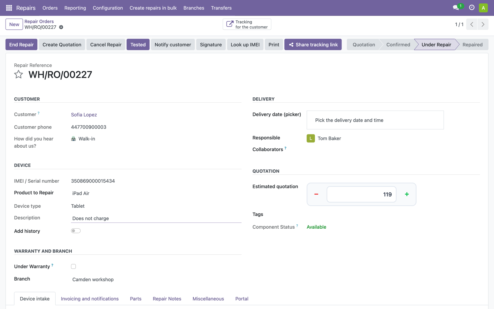
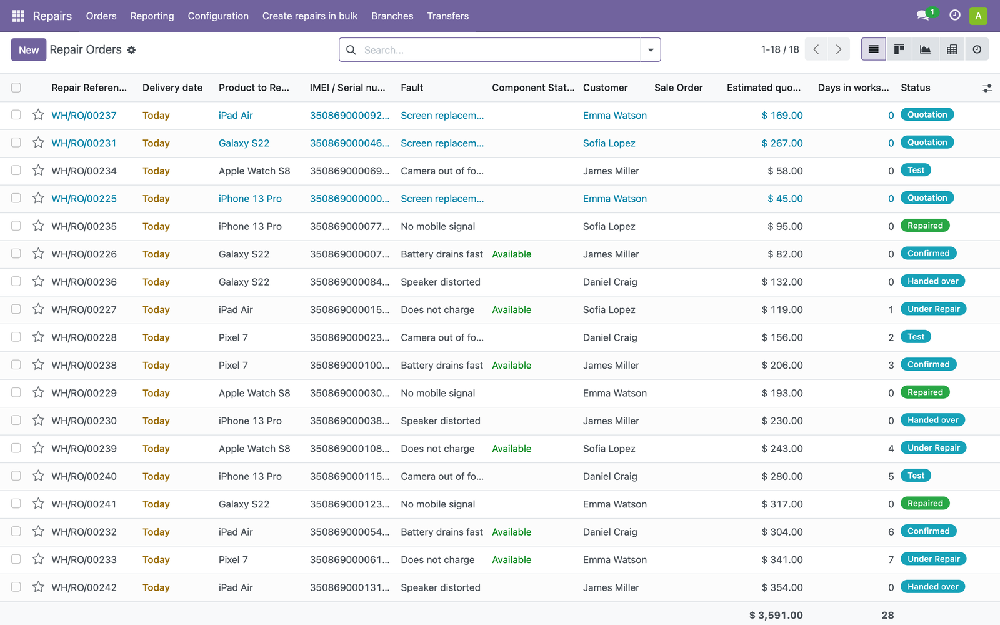
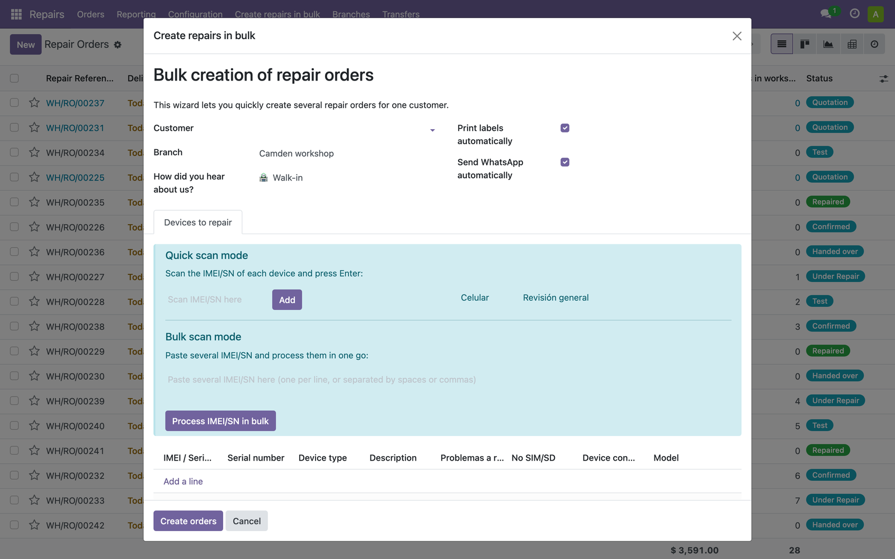
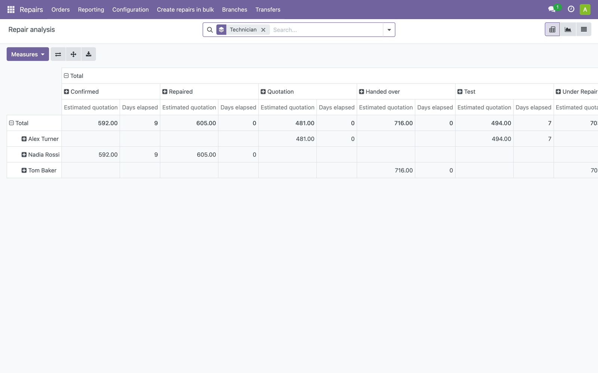
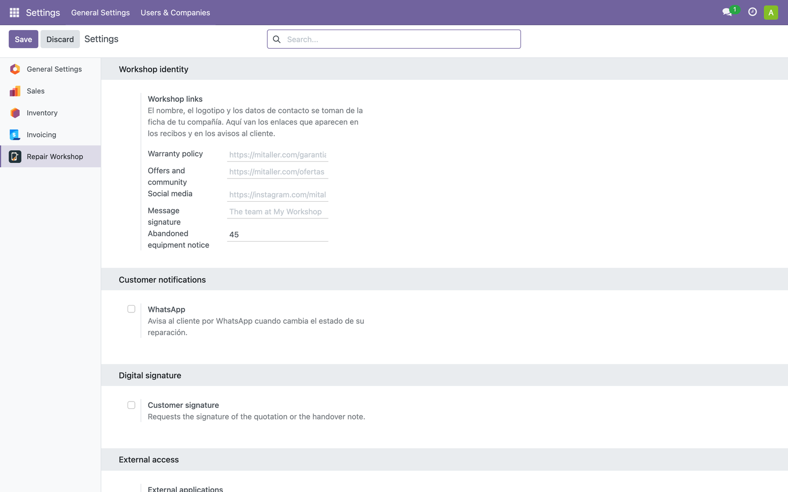

# Axer Repair

Módulo de Odoo 17 para gestionar un taller que repara móviles, tabletas,
relojes y portátiles. Amplía el módulo **Repair** de Odoo con lo que necesita
un taller que atiende a clientes finales: recepción del equipo con su estado,
seguimiento para el cliente, avisos automáticos y firma del presupuesto.


| | |
|---|---|
| **Módulo** | `axer_repair` |
| **Versión** | 17.0.1.0.0 |
| **Odoo** | 17.0 Community |
| **Licencia** | AGPL-3 |
| **Idiomas** | Inglés, con traducción al español incluida |

---

## Qué hace

### Recepción del equipo

Cada aparato entra con su IMEI o número de serie, su avería y **quince
comprobaciones del estado en que llega**: pantalla, táctil, cámaras, señal,
wifi, micrófono, altavoz, carga, botones y batería. Lo que no se pudo probar
queda registrado, de modo que en la entrega no hay discusión sobre qué
funcionaba y qué no.



Las comprobaciones solo aparecen si el equipo enciende, y las de reloj
(la correa, su talla) solo cuando el tipo de equipo lo justifica.

### Seguimiento para el cliente

El cliente recibe **un enlace con clave** para ver el estado de su reparación
cuando quiera, sin cuenta ni contraseña. La página muestra el historial de
estados por los que ha pasado su equipo.

En cada cambio de estado se le puede enviar un mensaje por WhatsApp, con el
texto redactado a mano o por un asistente de IA.

### Todas las reparaciones a la vista

Las que se han pasado de la fecha prometida salen **en rojo**; las canceladas,
en gris. Cada usuario elige qué columnas ver entre las veintisiete
disponibles, y Odoo recuerda su elección.



### Alta de varios equipos a la vez

Cuando un cliente trae ocho teléfonos, se dan de alta escaneando los IMEI uno
a uno o pegando la lista entera. Se les puede imprimir la etiqueta y avisar al
cliente automáticamente.



### Análisis

Tabla dinámica y gráficos que **cada usuario configura a su gusto**: arrastra
a filas y columnas el técnico, el tipo de equipo, la avería, el IMEI, el
cliente, la sucursal o el origen del cliente, y elige qué medir. El resultado
se guarda como favorito y se exporta a hoja de cálculo.



Con filtros para el día a día, entre ellos **Fuera de plazo** y
**Se entregan hoy**.

### Impresión

Recibo de entrada con código de barras y QR de seguimiento, etiqueta de equipo
y etiqueta QR. Si hay un servidor CUPS configurado, los documentos se envían a
la impresora de la sucursal; si no lo hay, **se ofrece el PDF** para
imprimirlo desde el navegador. El módulo sirve igual sin CUPS.

### Sucursales y traslados

Cada reparación pertenece a una localidad, con sus propias impresoras de
etiquetas y de recibos. Los equipos se mueven entre sucursales con recepción
confirmada, escaneando el código de barras.

---

## Integraciones, todas opcionales



Cada una tiene su interruptor en **Ajustes → Taller de reparación** y,
mientras esté apagada, el módulo **no llama a ningún servicio externo**.

| Integración | Para qué |
|---|---|
| **WhatsApp** | Avisar al cliente en cada cambio de estado |
| **Firma digital** | Que el cliente firme el presupuesto o la entrega |
| **Consulta de IMEI** | Recuperar modelo y estado del equipo. *Estos servicios cobran por consulta* |
| **Asistente de IA** | Redactar los mensajes de seguimiento. Admite proveedores compatibles con la API de OpenAI y modelos locales |
| **Sincronización externa** | Replicar productos y contactos en una segunda base de datos Odoo |
| **Acceso desde fuera** | Clave para aplicaciones que consulten reparaciones y secreto del webhook de firma |

El nombre y el logotipo que salen en recibos y etiquetas se toman de la ficha
de tu compañía; los enlaces propios (garantía, ofertas, redes sociales) se
configuran en el bloque **Identidad del taller**.

---

## Instalación

Añade este repositorio a tu `addons_path` y actualiza la lista de aplicaciones:

```
addons_path = /ruta/a/AxerRepair,/otras/rutas
```

Dependencias de Python:

```
requests  qrcode  babel
```

El asistente de IA necesita además `openai`, que solo se importa si el
asistente está activado: sin él, el módulo instala y funciona igual.

Antes de imprimir, indica en **Reparaciones → Localidades** el servidor CUPS y
el nombre de las colas de impresión de cada sucursal.

---

## Direcciones públicas

| Dirección | Quién entra |
|---|---|
| `/repair/track/<id>/<token>` | El cliente, con el enlace que se le envía |
| `/repair/label/<id>/<token>` | Igual, para imprimir su etiqueta |
| `/repair/bulk/<id>/<token>` | Resumen de varios equipos del mismo cliente |
| `/api/get-repair-orders` | Aplicaciones externas, con la clave de la API |
| `/api/send-message` | Igual |
| `/docuseal/webhook/` | El servicio de firma, con el secreto compartido |

Ninguna devuelve el código de desbloqueo del equipo. Sin credencial, todas
responden 403 o 404.

---

## Pruebas

```bash
odoo -d BASE -u axer_repair --test-enable --test-tags=/axer_repair
```

Veintidós pruebas que cubren el ciclo completo de una reparación, la
generación de los informes, la impresión sin CUPS instalado y el rechazo de
las direcciones públicas sin credencial.

---

## Autoría

Desarrollado por **Pablo Holguín** —
[Innovación Tecnológica SK](https://www.innovaciontecnologica.com.do).

Copyright © 2024-2026 Pablo Holguín.

## Licencia

AGPL-3. Consulta el fichero [`LICENSE`](LICENSE).

Este programa es software libre: puedes redistribuirlo y modificarlo según los
términos de la GNU Affero General Public License, en su versión 3 o posterior.
Se distribuye sin ninguna garantía.
